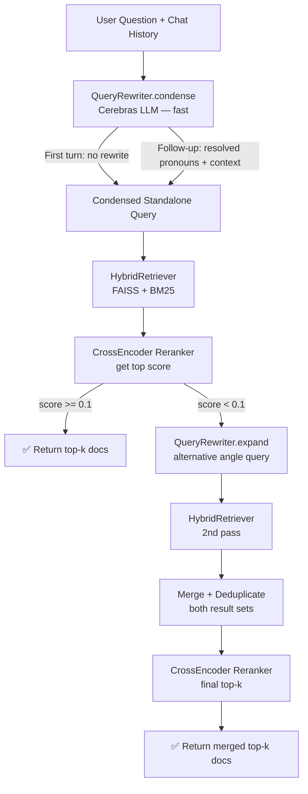

# Smart RAG Retrieval — Walkthrough

## What Changed

Single file modified: [main.py](file:///E:/Flask/Playage_Support_Bot/Version-1.0/Backend/main.py)

---

## New Pipeline (replaces line 525 in old file)



---

## Changes Made

| What | Where | Detail |
|---|---|---|
| 2 new env constants | Line 51–52 | `RETRIEVAL_CONFIDENCE_THRESHOLD=0.1`, `QUERY_REWRITE_HISTORY_TURNS=3` |
| `query_rewriter` global | Line 257 | `None` at module level, set in [startup()](file:///E:/Flask/Playage_Support_Bot/Version-1.0/Backend/main.py#262-310) |
| [startup()](file:///E:/Flask/Playage_Support_Bot/Version-1.0/Backend/main.py#262-310) updated | Line 261, 302 | Adds `query_rewriter` to globals; initialises [QueryRewriter(llm=llm_backup)](file:///E:/Flask/Playage_Support_Bot/Version-1.0/Backend/main.py#509-566) |
| [QueryRewriter](file:///E:/Flask/Playage_Support_Bot/Version-1.0/Backend/main.py#509-566) class | Lines 509–565 | [condense()](file:///E:/Flask/Playage_Support_Bot/Version-1.0/Backend/main.py#539-554) + [expand()](file:///E:/Flask/Playage_Support_Bot/Version-1.0/Backend/main.py#555-566) methods using Cerebras LLM |
| [smart_retrieve()](file:///E:/Flask/Playage_Support_Bot/Version-1.0/Backend/main.py#568-622) fn | Lines 568–621 | 3-stage pipeline returning [(docs, score)](file:///E:/Flask/Playage_Support_Bot/Version-1.0/Backend/main.py#627-786) |
| `/ask` route | Lines 648–656 | Replaces 4-line naive retrieval block with [smart_retrieve()](file:///E:/Flask/Playage_Support_Bot/Version-1.0/Backend/main.py#568-622) call |

---

## How Each Stage Works

### Stage 1 — Query Condensation
- **Skip condition**: if `chat_history == "No previous conversation."` → use raw question (zero latency penalty on turn 1)
- **LLM prompt**: asks Cerebras to produce a single-line standalone query
- Uses only last **3 turns** of history (`QUERY_REWRITE_HISTORY_TURNS`) to keep the rewrite prompt tight

### Stage 2 — Confidence Check
- CrossEncoder `ms-marco-MiniLM-L-6-v2` scores each (query, doc) pair
- `top_score` = `max(scores)` across all retrieved docs
- If `top_score >= 0.1` → confident, return immediately (fast path)

### Stage 3 — Adaptive Fallback
- Triggered only when confidence is low
- [expand()](file:///E:/Flask/Playage_Support_Bot/Version-1.0/Backend/main.py#555-566) generates an alternative-angle query (different keywords / broader scope)
- Second retrieval pass runs; results merged by [(doc_id, section)](file:///E:/Flask/Playage_Support_Bot/Version-1.0/Backend/main.py#627-786) key
- Final rerank on the expanded query → top-k returned

---

## Server Logs to Watch

```
[QueryRewriter] condensed → 'How to export player transaction report in Playage Backoffice?'
[SmartRetrieve] Stage-1 top score: 0.4231 | threshold: 0.1
[SmartRetrieve] Final docs=5, confidence=0.4231

# OR when Stage 3 fires:
[SmartRetrieve] Stage-1 top score: 0.0412 | threshold: 0.1
[SmartRetrieve] Low confidence — expanding query for Stage-2 pass
[QueryRewriter] expanded → 'Playage Backoffice reporting and analytics features'
[SmartRetrieve] Stage-2 top score: 0.3810 | merged docs: 18
[SmartRetrieve] Final docs=5, confidence=0.3810
```

---

## Tuning via `.env`

| Variable | Default | Effect |
|---|---|---|
| `RETRIEVAL_CONFIDENCE_THRESHOLD` | `0.1` | Lower → fewer Stage-3 triggers; raise if too many fallbacks |
| `QUERY_REWRITE_HISTORY_TURNS` | `3` | History turns fed to the condense prompt |
| `RERANK_TOP_N` | `5` | Max docs returned to the LLM |
